# 看番，然后变成技术宅

## 写在前面

在一切开始之前，先进行一端叠甲：如果在看番方面对看网络资源的排斥的话，大可以不那么大费周章整一套下载、刮削流程。

简单一点的做法是找一个线上网站看。复杂一点的做法是用大佬们写好的资源整合软件，[Animeko](https://myani.org/)或者[Kazumi](https://kazumi.cn/)，两者都能得到不错的线上追番体验。

我在各个步骤选择的软件可能也并非最易上手，但很大程度上是符合Unix philosophy的：

> Do one thing and do it well.

本文仅作为我目前使用的追番流程及对应配置文件的简单记录。

## Docker基础配置

有关我的硬件和OMV系统的内容已在之前的[博文](/post/nas-setup)中有所记载。

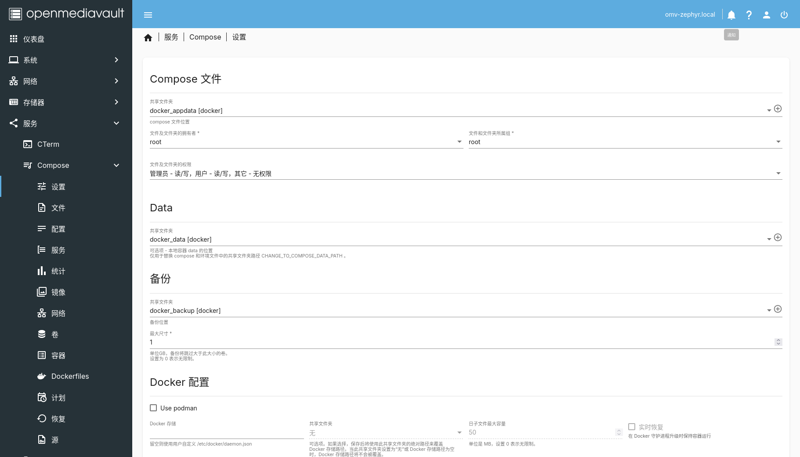

值得一提的是，OMV的Compose插件可以配置一个data文件夹用来存放docker应用的配置文件或者缓存。这个文件路径有一个OMV自带的环境变量`CHANGE_TO_COMPOSE_DATA_PATH`，在compose文件中替换掉对应的路径。

有许多变量在不同的compose文件中反复出现，可以写到OMV的docker compose插件的全局环境变量中。

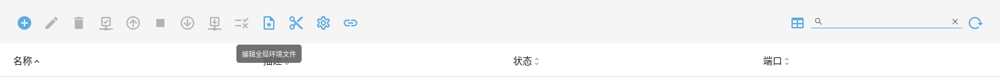

大多数docker应用都有用户ID、组ID、时区设置，可以统一设置。

```
PUID=1000
PGID=100
TZ=Asia/Shanghai
```

在OMV系统中，硬盘是按uuid挂载的，文件名贼长，因此可以在全局环境变量中添加硬盘路径的alias，比如`SSD=/srv/dev-disk-by-uuid-...`。

我同时在全局变量中加入了`SSD`（下载盘）、`OPTANE`（大量读写的文件同步盘）、`HDD`（完结番剧的归档盘）的配置，可以避免每次写compose文件都要复制一长串文件夹名的繁琐步骤。

## QBittorrent

### 基础配置

<details>
<summary>docker compose文件</summary>

```yaml
---
# https://hub.docker.com/r/linuxserver/qbittorrent
services:
  qbittorrent:
    image: lscr.io/linuxserver/qbittorrent:latest
    container_name: qbittorrent
    environment:
      - PUID=${PUID}
      - PGID=${PGID}
      - TZ=${TZ}
      - WEBUI_PORT=8080
      - TORRENTING_PORT=39692
    volumes:
      - CHANGE_TO_COMPOSE_DATA_PATH/qbittorrent/config:/config
      - ${SSD}/downloads:/downloads
    network_mode: host
    # ports:
      # - 8080:8080
      # - 39692:39692
      # - 39692:39692/udp
    restart: unless-stopped
```

</details>

这里部署qb使用了host网络模式，是和下文中的PeerBanHelper联用所必须的。如果不用防某雷客户端吸血的话可以使用linuxserver官方示例中的桥接并映射端口的模式。

部署后就可以通过`<ip>:8080`在浏览器中看到qb的web登录界面。

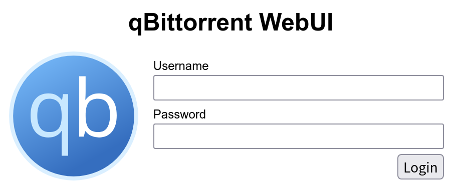

在某个版本之后，qb的初始用户名密码需要到docker日志中寻找。需要ssh连接到OMV，再`sudo docker logs qbittorrent`查看。

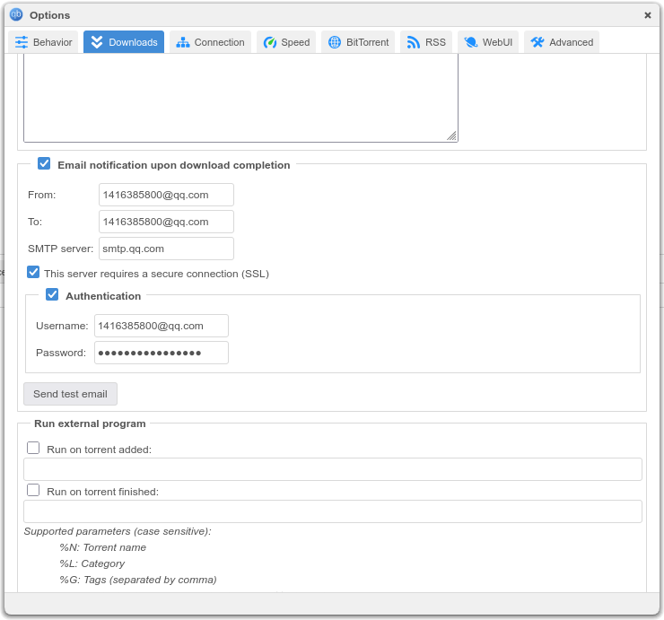 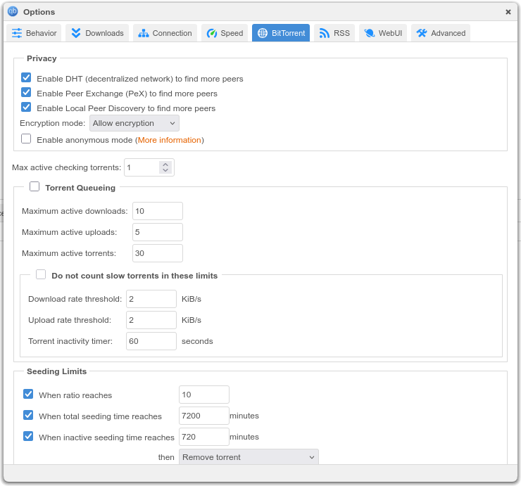 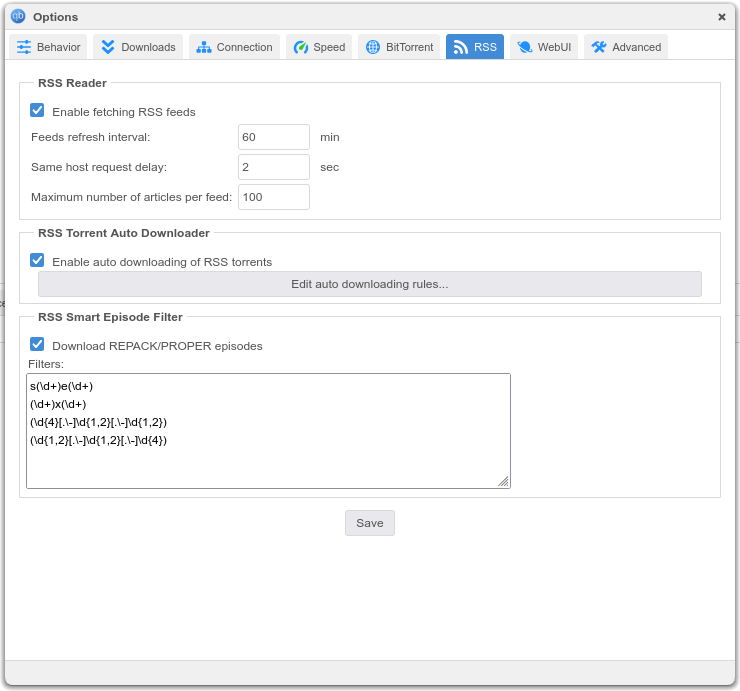

qb的webui中，我主要是动了以下设置：下载完成的邮件通知——通过SMTP发给我的qq邮箱，这里不多展开；bt下载的停止规则——主要是为了放置挂了太多做种导致爆了我的4G内存；RSS设置——这部分是自动下载新番的关键。

### RSS订阅及下载规则

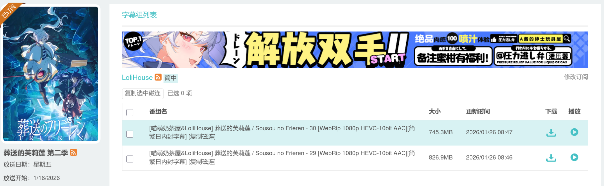

在[Mikan Project](https://mikanime.tv/)或者其他新番字幕组的发布站点上寻找想看的番剧的RSS链接（橙色的小图标右键-复制链接）。

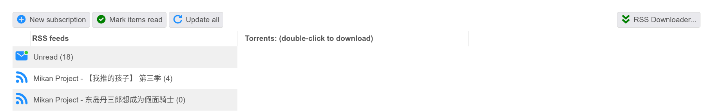

在qb的RSS界面中选择New Subscription，粘贴RSS链接-OK。加载一段时间就能在左边看到订阅信息。

注：我没有使用我自己用户对应的总的订阅链接，而是对于每个想看的番都在qb中订阅了一个字幕组的RSS链接。

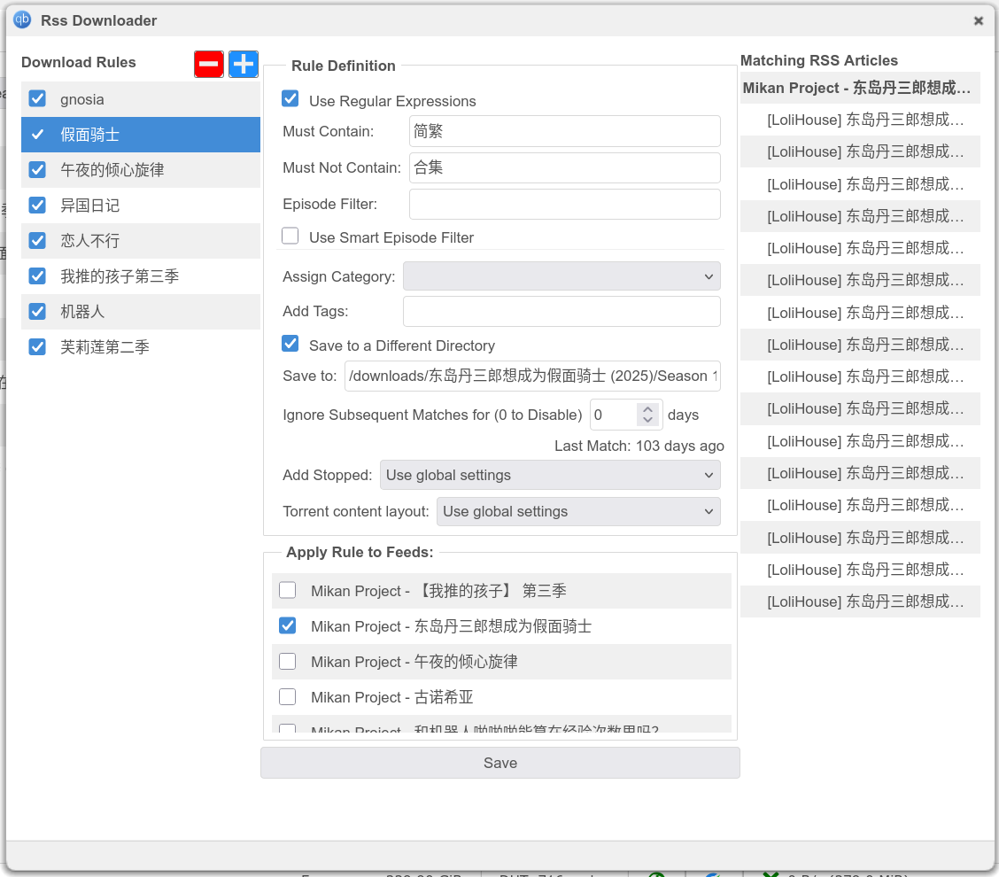

之后可以打开RSS Downloader界面，配置每个新番的下载规则。这里可以设置只下载某一种字幕的文件（我的习惯是下“简繁”双字幕的），并排除掉合集。

<details>
<summary>下载文件夹设置</summary>


设置下载文件夹主要是为了让刮削器更好识别，因此都设置成了[TMDB](https://www.themoviedb.org/)上的番剧名称的样子，分季也最好按TMDB的样子分（文件夹名字`Season X`这样），这样后续使用TinyMediaManager刮削就不会刮错了。

</details>

最后把特的规则应用到具体的RSS订阅上，点save之后就可以在最右边看到匹配到的文件。如果开了自动下载，所有匹配中的文件就都已经开始下载了。

总的来说，我目前的新番下载策略是半自动的。每当一部番开始之时，我需要设置对应的RSS链接、下载规则、文件夹，设置完成后更新的集数才是真正自动下载的。

### PeerBanHelper防吸血

PBH文档中不推荐使用:latest标签拉取docker镜像，因此compose文件中是具体的版本号。

<details>
<summary>docker compose文件</summary>

```yaml
---
version: "3.9"
services:
  peerbanhelper:
    image: "ghostchu/peerbanhelper:v9.2.5"
    restart: unless-stopped
    container_name: "peerbanhelper"
    volumes:
      - CHANGE_TO_COMPOSE_DATA_PATH/peerbanhelper:/app/data
    network_mode: host
    stop_grace_period: 30s
```

</details>

具体的配置直接跟着[PBH的文档](https://pbh-docs.ghostchu.com/docs/downloader/qBittorrent)走就可以了，文档非常详细。

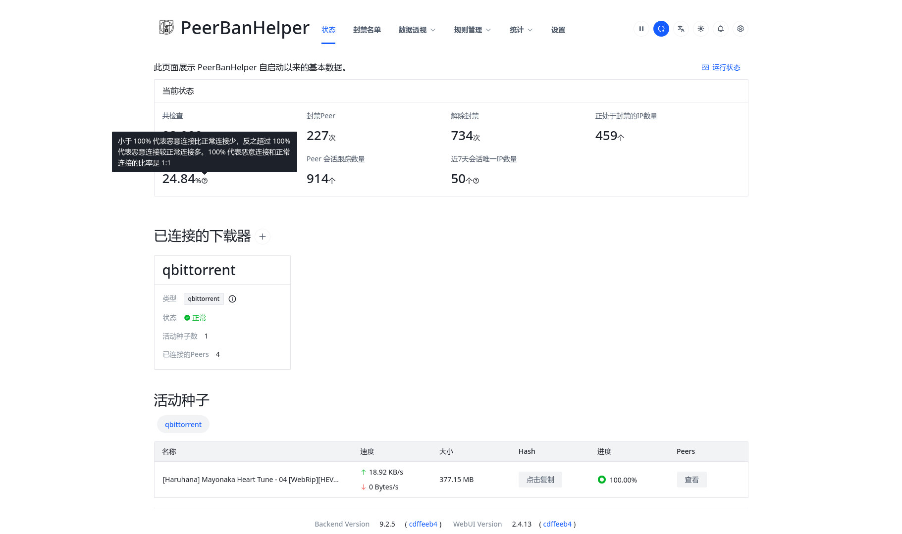 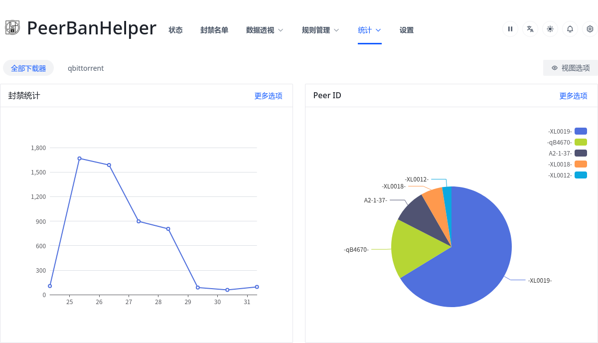

我本来没觉得我的下载新番会遇到那么多吸血客户端的，但是挂上PBH后，确实能够发现许多用某雷下载新番的IP，刻板印象了属于是orz

## TinyMediaManager

### 基础配置

<details>
<summary>docker compose文件</summary>

```yaml
---
services:
  tinymediamanager:
    image: tinymediamanager/tinymediamanager:latest
    container_name: tinymediamanager
    environment:
      - PUID=${PUID}
      - PGID=${PGID}
      - TZ=${TZ}
      - USER_ID=${PUID}
      - GROUP_ID=${PGID}
      - ALLOW_DIRECT_VNC=true
      - LC_ALL=en_US.UTF-8 # force UTF8
      - LANG=en_US.UTF-8   # force UTF8
      - PASSWORD=${PASSWORD}
    volumes:
      - CHANGE_TO_COMPOSE_DATA_PATH/tinymediamanager/data:/data
      - ${SSD}/downloads:/media/downloads
      - ${HDD}/media/anime:/media/anime
      - ${HDD}/media/movie:/media/movie
      - ${HDD}/media/tv:/media/tv
    ports:
      - 5900:5900 # VNC port
      - 4000:4000 # Webinterface
    restart: unless-stopped
```

</details>

docker版本的TMM其实是在一个完整的ubuntu桌面环境里运行的，然后通过VNC在网页中显示画面。环境变量中的PASSWORD是VNC的密码，如果只是局域网内登TMM，可以设成空的。

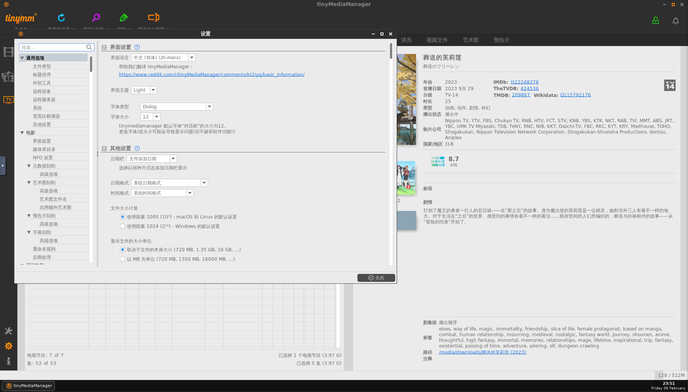

TMM的设置左侧菜单的每一行都可以点，就比如说“通用选项”里是有配置选项的，可以首先在这里把TMM界面设置成中文。

### 刮削配置

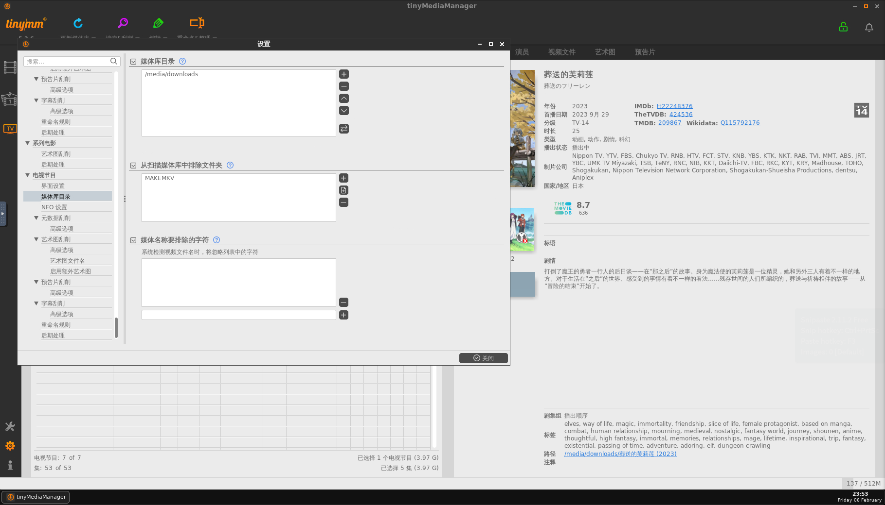

新番在TMM中对应TV Shows（电视节目）这一大类。把之前compose中映射过来的文件夹映射过来，刷新就可以看到TMM载入了已经下载好的新番。

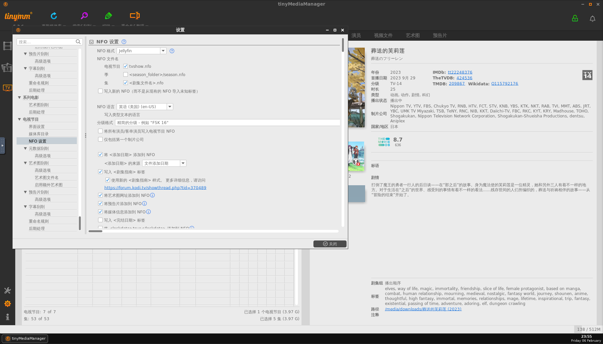

接下来可以把NFO格式设置成Jellyfin。

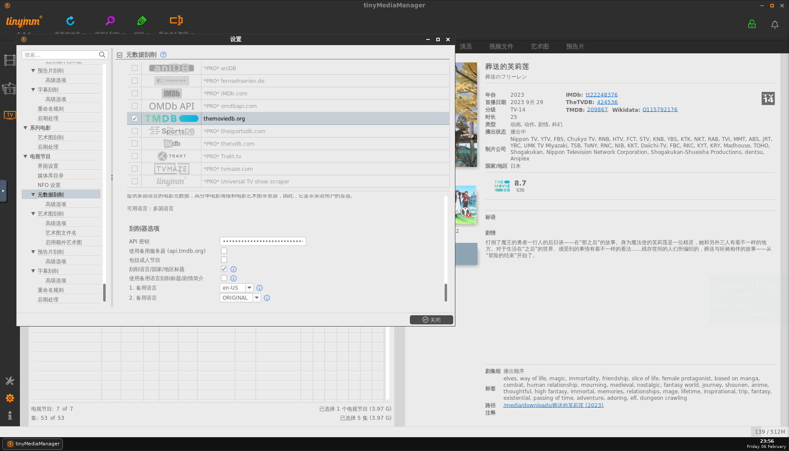 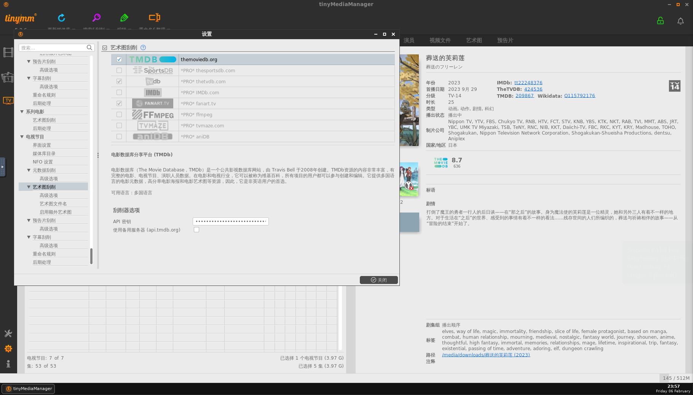

刮削全靠TMDB，需要在TMDB先注册一个账号，然后申请一个API Key，填到TMM配置中。注意”元数据刮削“和”艺术图刮削“都需要填API Key。

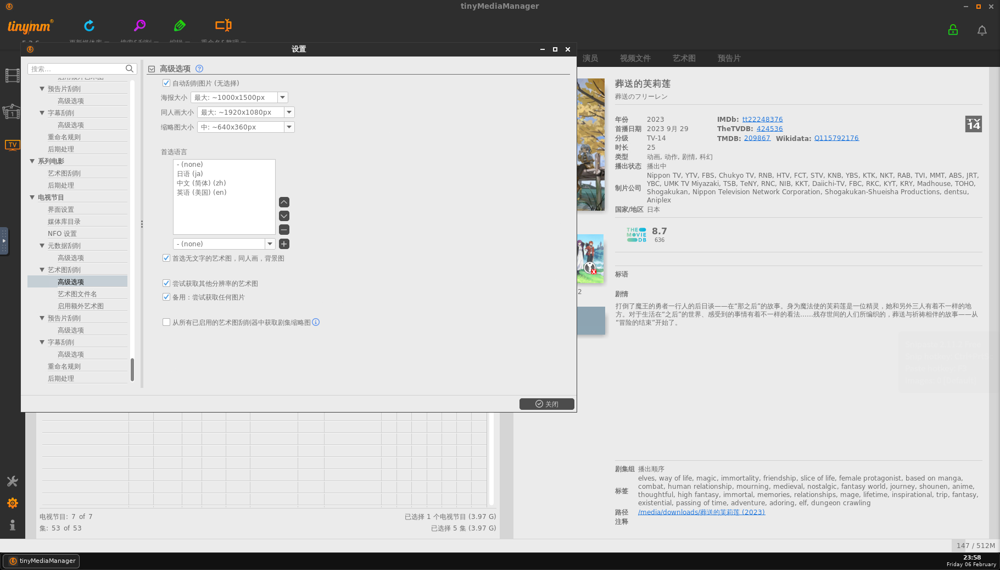

关于海报的语言，由于下载的大多是霓虹的新番，因此我最开始是设置的优先刮削了日文海报。

然而啊，有些新番，名字简直片假名地狱，日文海报标题也很丑，所以我就把无语言的海报调到了第一位，优先刮削不带任何文字的新番海报。

如果下载的文件里包含一些采访或者音乐文件，那么可以在对应的文件夹里新建一个文件名为`.nomedia`的文件，再刷新媒体库，TMM中这些刮削不出来的文件就会消失。

### tmdb改host

tmdb大概率在目前网络环境是无法直连的，不过也不需要科学上网，用网络上矿神大佬的脚本自动改个host就行了（`curl -L http://code.imnks.com/hosts-auto1007.sh | bash`）。

## Jellyfin

### 基础配置

<details>
<summary>docker compose文件</summary>

```yaml
---
# https://hub.docker.com/r/linuxserver/jellyfin
services:
  jellyfin:
    image: lscr.io/linuxserver/jellyfin:latest
    group_add: 
      - "102"
    container_name: jellyfin
    environment:
      - PUID=${PUID}
      - PGID=${PGID}
      - TZ=${TZ}
      - DOCKER_MODS=linuxserver/mods:jellyfin-opencl-intel
    volumes:
      - CHANGE_TO_COMPOSE_DATA_PATH/jellyfin/config:/config
      - CHANGE_TO_COMPOSE_DATA_PATH/jellyfin/cache:/cache
      - ${SSD}/downloads:/downloads
      - ${HDD}/media:/media
    devices:
      - /dev/dri:/dev/dri
    ports:
      - 8096:8096
      - 8920:8920 #optional
      - 7359:7359/udp #optional
      - 1900:1900/udp #optional
    extra_hosts:
      - "host.docker.internal:172.17.0.1"
    restart: unless-stopped
```

</details>

Jellyfin大多数配置都会在初始化的时候完成，只要TMM刮削得到位，在Jellyfin里就只管看就完事了。

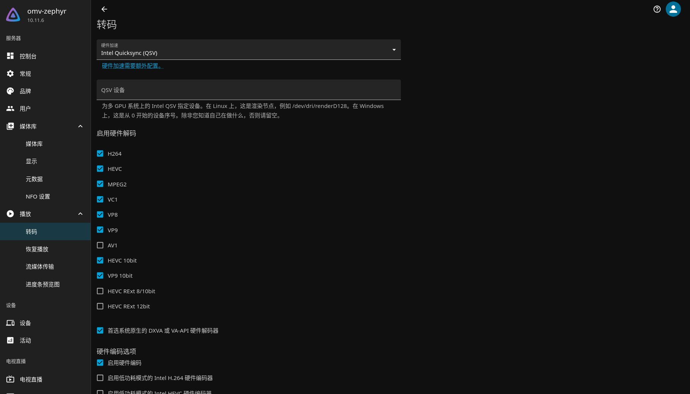 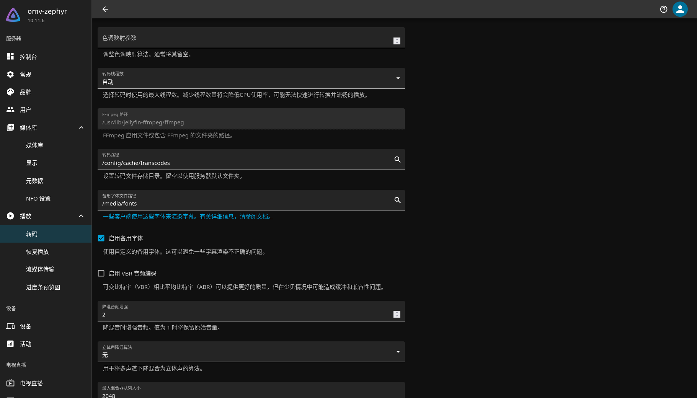

硬解+转码什么的，对我这个仅在局域网看番的人来说没什么影响。不过我也依旧是设置了intel硬解的MOD（compose文件中引入`DOCKER_MODS=linuxserver/mods:jellyfin-opencl-intel`环境变量），然后在Jellyfin中设置转码用Intel QSV（具体用哪个可以看[Jellyfin官方文档](https://jellyfin.org/docs/general/post-install/transcoding/hardware-acceleration/)）

如果用Jellyfin直接在网页里播放带中文字幕的新番，那么最好导入一个font文件夹（注意font文件夹中文件的总大小是有一个很小的上限限制的，如果中文字幕显示为方块就说明字体文件大小超了，我印象中是20 MB来着）。

如果要像我现在这样用mpv看番，那么就可以无视上面的配置。

值得注意的是，Jellyfin中忽略一个文件夹是用`.ignore`文件，和TMM中有所不同。

### 用本地mpv观看并载入弹幕

这部分文件都是下载到看番的设备的，不是在NAS端部署。

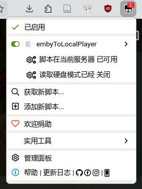

使用[embyToLocalPlayer](https://github.com/kjtsune/embyToLocalPlayer)，利用油猴脚本让本地mpv接管jellyfin中的播放。具体方法可以看etlp的README。

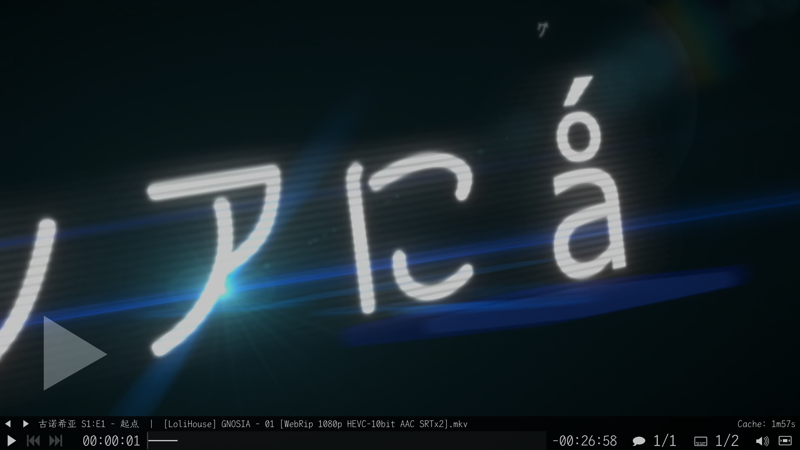   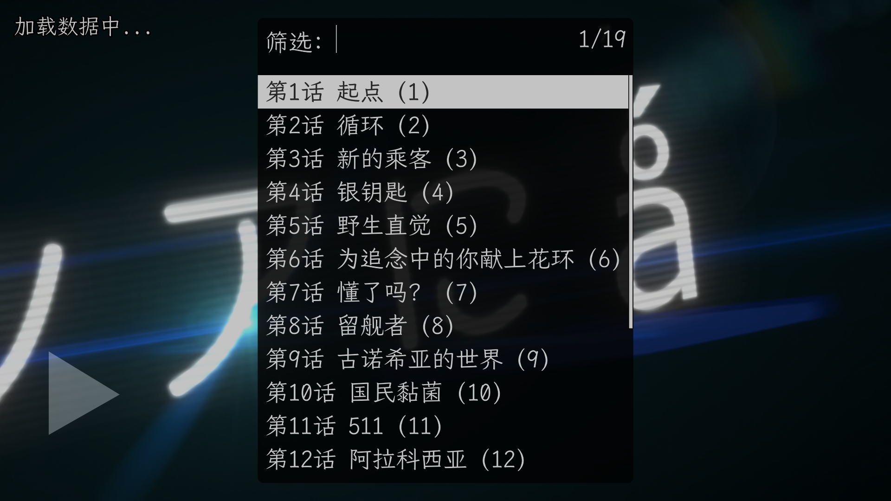 

mpv载入[uosc_danmaku](https://github.com/Tony15246/uosc_danmaku)脚本，可以搜索弹弹Play的弹幕，加载到mpv中。这个mpv脚本其实不需要uosc也可以运行，效果如上图。至于mpv的脚本怎么配置以及我用了哪些脚本，这或许又可以搞一篇博客（不过大多数脚本我都几年没动过了）。

## Bangumi-syncer

### 基础配置

<details>
<summary>docker compose文件</summary>

```yaml
---
services:
  bangumi-syncer:
    image: sanaemio/bangumi-syncer:latest
    container_name: bangumi-syncer
    network_mode: bridge
    ports:
      - "8000:8000"
    volumes:
      - CHANGE_TO_COMPOSE_DATA_PATH/bangumi-syncer/config:/app/config
      - CHANGE_TO_COMPOSE_DATA_PATH/bangumi-syncer/logs:/app/logs
      - CHANGE_TO_COMPOSE_DATA_PATH/bangumi-syncer/data:/app/data
    restart: unless-stopped
    environment:
      - PUID=${PUID}
      - PGID=${PGID}
      - TZ=${TZ}
```

</details>

### 自动点格子设置

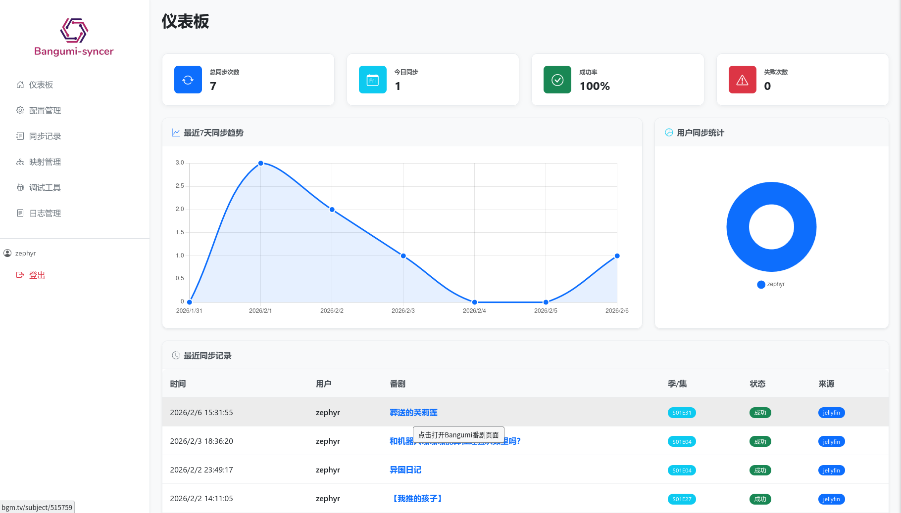

这个完全对照着[bangumi-syncer](https://github.com/SanaeMio/Bangumi-syncer)的github页面上的说明做就行。

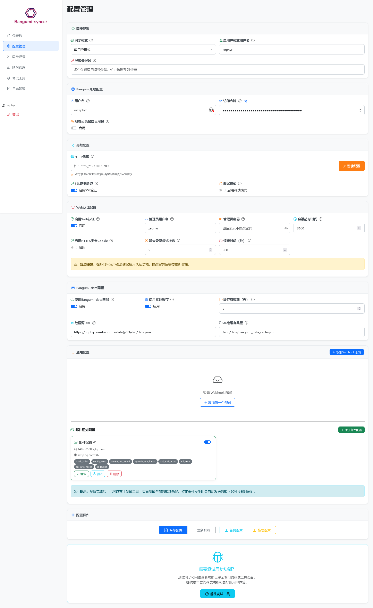 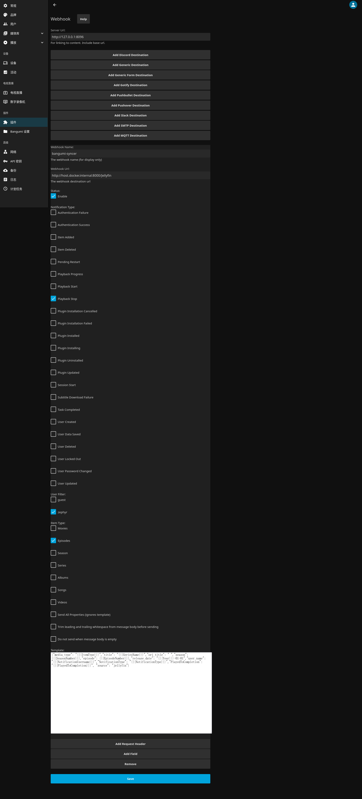

在bangumi-syncer页面中需要配置bangumi的api信息，在Jellyfin中需要下载一个webhook插件然后设置一个看完一集后的webhook。

我额外增加了一个同步失败后的邮件通知配置。

## 总结

省流：RSS订阅链接（Mikan）→qb下载→TMM刮削→Jellfin建影视库→mpv带弹幕观看→Bangumi-syncer自动点格子
