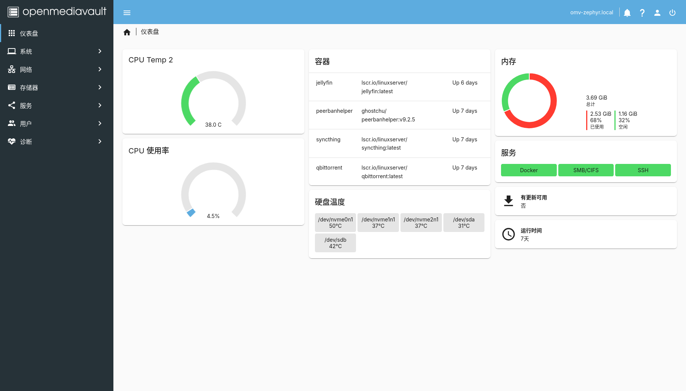

> Cover image from [OpenMediaVault official website](https://www.openmediavault.org/).

# 从零开始的个人NAS生活

## 前言

本文无意成为NAS配置的参考或教程，不论从硬件还是软件上看，市场上其实都有相较于我的配置体验更好、简单易用的搭配。

我只是刚好在特定时间看到了特定的适合于我自己的相关硬件，最终攒出了这么一套配置。

我的需求也并非很重度地使用NAS，不过是下点新番，简单同步、备份文件。没有大的视频需要剪辑，没有蓝光原盘电影收藏。

甚至总得看下来，我的硬件配置就没有一件是我从正经渠道购得的。

但站在2026年1月的存储价格高涨的时间节点上来看，我这套算是性价比极高了，甚至稳定性也极高。

唉，后悔之前没有买个8 T或者10 T的HA340。

尽管我现在连4 T的硬盘都没有存满orz

## 硬件

### 硬件总表

| 配件 | 型号 | 购入价（元） | 平台 |
| - | - | - | - |
| 品牌机 | 惠普小欧 S01-pf012ccn | 600 | 跳蚤市场 |
| CPU | Intel赛扬G4930 (2C2T) | - | - |
| 内存 | 4 GB DDR4 2400<sup><i>b</i></sup> | - | - |
| _M.2固态_ | _512 GB SN530_ | - | - |
| 系统盘 | 16 GB Intel傲腾M10（二代） | 12.7 | 某宝 |
| 机械硬盘 | 4 TB 西数蓝盘WD40EZRZ | 220 | 跳蚤市场 |
| ~SATA固态~ | ~480 GB 固德佳GS-480~ | ~150~ | ~pdd~ |
| SATA固态 | 480 GB SM863（HPE版） | 150 | 某鱼 |
| U.2固态 | 375 GB Intel傲腾P4800X（带m.2转接卡） | 700 | 某鱼 |
| PCIE转M.2 | PCIE4.0 x16 佳翼海星1号 | 19.9 | 某宝 | 
| PCIE转M.2 | PCIE4.0 x1 佳翼海星2号 | 26.9 | 某宝 |
| 光驱位硬盘架 | 薄光驱转2.5寸SATA（大迈） | 14 | 某东 |
| **总计** | | **1743.5** | |

### 机箱

自组NAS其实最关键的就是机箱了。

从这个配件表的第一行就初见端倪，可以看出我这套配置之罕见（骂谁罕见！），整套NAS的基础居然是惠普的品牌机，甚至还不是那些NAS区博主常推的型号。

有一说一，我最初看的还真是惠普的800系列SFF机箱。7代（800 G3）准系统那会儿应该是200以内，可以配奔腾G4560；8代（800 G5）准系统大概是250，可以装i3-8100(T)。

事情发生在大约一年半前的某天，我在BBS逛跳蚤市场版的时候，意外发现了这个惠普小欧主机。卖家本是按正常的win主机卖的，我却看到了其作为NAS的潜力 ~（肯定不是因为跑Win 11太卡了）~。

这套惠普小欧S01在我购入时包含了一整套能开机的硬件，机箱、主板、CPU、品牌机散热器、内存、一块M.2固态硬盘，甚至还有一块无线网卡（虽然最后还是插的网线）。原装的M.2固态是装了一个win 11。我后续没动这条原装的M.2，未来要是别的小主机需要，可以直接拆了装过去。

机箱内部带1个3.5寸硬盘位（兼容2.5寸硬盘）+1个2.5寸硬盘位（可以装U.2，我实际上也是把P4800X装在这个位置）。SATA的数据线和供电线是配齐的，都是从电源到主板再转出来的。这就是惠普品牌机主板的优势，不会因为配置里没有就把焊盘空在哪里（不要无端联想）。

光驱位是空着的，但是光驱位的供电线是有的（是光驱位特有的5pin供电），可以通过光驱位硬盘架转接出一个2.5寸硬盘位。

总体来说，600块整体按当时的行情来看，是有点浪费的，毕竟HP 800系列把硬件配齐应该也才不到500。

### CPU

是G开头的赛扬，G4930，真要说的话性能还不如7代的奔腾G4560。

但够用了，目前除了开机之后的短时间内启动各种服务会报个高占用的警告外，没有任何瓶颈。

（其实千兆网口在我的日常应用中也从来没有瓶颈过，所以这个羸弱的CPU也没拖后腿，可以说是非常平衡的配置了orz）

NAS的CPU，大多数时候占用不足1%，真不需要焦虑吧……

不过如果i3-8100降到白菜价，倒也不是不能买一个换上。根据惠普官方的[主板说明](https://support.hp.com/us-en/document/c06460332)，这个主板是可以支持8100（非T）的。

### 内存

其实我起初只知道是4 GB的DDR4内存，后面装完系统后才发现这条内存其实是海力士颗粒、单条3200频率，只是G4930只能跑在2400频率上。

唉，又一后悔之处，应该趁内存条便宜补一根4 GB组双通道的。

现在的容量经不起我在Docker里self-host带数据库的web应用（实测LinkWarden会爆内存），相册也没法开AI，BT下载做种也不能挂太多。

跑点普通的相册、当个文件服务器非常够用了。

> Free RAM is wasted RAM.

### 硬盘配置

#### 系统盘

16 GB的傲腾M10被大伙戏称为“M.2防尘塞”，但它有着近乎无限的寿命（听说这盘寿命写完还可以一直继续写，不过我估计我这辈子用不完这盘的寿命），容量足够装下任何NAS系统，用来当NAS的系统盘再合适不过了。

16 G在系统里会缩水成13.4 G，刨去`/boot/efi`和swap还能余下12 G的空间（当然，这个可以在装系统的时候设置），装完NAS系统还能剩下一大半。空间非常充裕。

#### 机械硬盘

依旧是跳蚤市场捡到的，时间大概是24年5月。看到4T的蓝盘卖220就直接拿下了。

到手查看型号，CMR，通电15000小时，无坏道。标准的24x7通电盘的数据，大概是经过“锻炼”的健壮机械。

从当时的行情来看，也不算捡大漏（毕竟那会儿通电15000小时矿盘确实是按50/TB的价卖的）。

相比那些真·矿盘的16T氦气盘来说，4T蓝盘是真的安静，除了启动的时候有点声音外，正常读写都没什么明显声音。

#### 固态硬盘

##### 2.5寸SATA

###### 杂牌固德佳

表格中划去了不适合做NAS的杂牌SATA，显然是有故事在其中的。

想当年，固德佳和幻隐经常能上pdd百补加倍补，当时价格甚至能做到250/TB（23年会更低）。我也顺理成章地买了一个。

至于容量，我计划是用这个硬盘跑点下载和文件同步的工作，估计512 G左右就足够使用了。于是就150左右入手了一块480G固德佳。

最初的结果都很美好，但在系统运行了7500小时左右的时候。固德佳报出了他的第一个SMART警告，05重新分配扇区数+1，C5坏块数量+1。预示着固态颗粒内部存在了坏块。

在我把它送去售后之时，备用块使用数量已经达到了9。

希望售后不是给我用PC3000之类的软件重新开了下卡。不过哪怕真换新了，它的稳定性也不足以让我相信了。

等哪天我开始折腾OEC之类的电视盒子的时候，再把他用上吧。

###### 企业级固态

在买杂牌翻车后我开始紧急避险，寻求原厂和企业级固态。

说实话，当时我差点就把那块gentoo系统盘M8VC拿来救场了。或者直接把原装的SN530改成ext4当NAS的存储盘来用。

不过考虑到可能有些硬盘测试可能还要放Win上跑，因此还是把SN530保了下来。

受到一些贴吧贴子的影响，当时主要关注的是三星PM/SM 883/863。这些企业级固态都属于是不写入个1 PB都算是洒洒水的。

但24年中已经不是捡漏企业级固态的好时间，大多数企业级洋垃圾其实和原厂盘卖的价格差不了多少。

经过我不懈的蹲点，最终，我买到了这块卖150的HPE版SM863 480 GB。MLC的信仰不可取，但架不住它价格真比浦科特那些特挑MLC（M6VC到M8VC）甚至某些TLC（大部分原厂）便宜啊。再便宜一些也不是不可能，但基本会被奸商的脚本抢走。

HPE版当然好坏参半，不过这些都是我买回来之后才知道的了。

好处是它是MLC。坏处是它是HPE版。

在CrystalDiskInfo中无法显示具体的健康度（SMART参数本身能显示的就很少）。甚至连读写量都不报。某种程度来说，不显示就没有清零风险。

细看具体参数，用CDI还是能看出具体的具体读写操作次数（带写入放大的那个数），我大致算了一下，大概也就写了300T左右的数据，在SM863里算非常健康的了。

##### P4800X傲腾

P4800X 375GB和905P 480GB是我的两个梦中情盘，得其一则这辈子不用再担心硬盘寿命问题。而且这两个算是性价比最高的傲腾了。容量足够当下载盘，价格也是最便宜的一档。

买傲腾还有个好处。就是哪怕硬盘再涨，傲腾的二手价格也是一直在掉的，可以一直在某鱼蹲低价。

当然，这是废话，傲腾向来都是2 - 4元/GB的价格，买一块顶四块普通TLC了。

905P一直以来是价格更贵的那一个（除非能捡漏到卖600多的那一批货）。P4800X倒是一直在降价。

我是700块买的DIY玩家自用盘（只有几个T的读写、几千小时通电），还送一根安费诺原厂线。不过我其实也看到过5xx的盘，然而没能及时下手。

安装上通过PCIE转M.2、再用安费诺线M.2转U.2。

### Known Issues

- 傲腾M10装到主板M.2接口后系统无法识别。Workaround是通过PCIE转M.2转接卡插在主板的PCIE插槽。转接后依旧可以作为系统盘。
- P4800X 375GB虽然孔位是2.5寸SSD的孔位，但是厚度却是15 mm。机箱硬盘架上装满之后，硬盘会紧贴到其中一个SATA口，用原装的直头SATA线连接，需要比较大力弯折。不过考虑到它是SATA数据线，影响应该不大
- HPE版SM863健康度永远报良好，无法通过系统的smartmontools监控健康状态。好在它是MLC，我这辈子应该都写不完它的标称寿命。


## 软件



在我装这套NAS系统的时候，飞牛还未现世，DIY NAS的主流是黑群、TrueNAS、Unraid，以及我所使用的OpenMediaVault（OMV）。

但哪怕放到现在，其实我大概率也不会安装飞牛。飞牛的开箱即用就像是GNOME和Ubuntu，而我是个用Fedora、Arch、Gentoo的人。另一方面，我还是希望我的系统能是相对简单且开源的。

至于在众多开源系统上，我为什么没有选择TrueNAS？主要原因是OMV有国内的镜像源。在国内的网络环境下，OMV是真的几乎不用担心网络问题。

那么OMV缺点是什么呢？OMV需要做的初始配置还是多了一些，root密码、硬盘分区、user:group配置、联网、ssh、文件系统、共享文件夹，这些都是要手动设置的。

### OpenMediaVault安装与配置

OMV是一个基于Debian的开源NAS系统，其安装镜像总体的引导都是做得很不错的，安装没有什么难度。虽然不如其他NAS系统那样流行，但网络上OMV的教程还是不少的。

官方也给出了在Debian基础上安装OMV的教程。（但话又说回来了，都有Debian的底子了，可以装CasaOS）

启动后需要在路由器后台或者tty界面获得NAS的内网IP，之后就可以在日用电脑上用浏览器打开nas的管理界面了。默认的用户名和密码分别是`admin`和`openmediavault`，进系统的第一步就是修改用户名和密码。

由于debian、omv-extras、docker-ce这些repository在国内有可能难以访问，最好换个国内的镜像源。换源很简单，清华的镜像源中有[换源教程](https://mirrors.tuna.tsinghua.edu.cn/help/OpenMediaVault/)

```bash
omv-env set OMV_APT_REPOSITORY_URL "https://mirrors.tuna.tsinghua.edu.cn/OpenMediaVault/public"
omv-env set OMV_APT_ALT_REPOSITORY_URL "https://mirrors.tuna.tsinghua.edu.cn/OpenMediaVault/packages"
omv-env set OMV_EXTRAS_APT_REPOSITORY_URL "https://mirrors.tuna.tsinghua.edu.cn/OpenMediaVault/openmediavault-plugin-developers"
omv-env set OMV_DOCKER_APT_REPOSITORY_URL "https://mirror/docker-ce/linux/debian"
omv-salt stage run all
```

之后可以更新一遍系统（网页上更新和`apt-get`更新的效果是一致的）

随后创建个人账户（zephyr），并加入到_ssh和sudo分组当中，让用户拥有ssh和sudo权限。添加ssh公钥，这之后就可以把ssh配置中的密码登录选项关掉了。

这之后其实就可以root密码删除了，甚至可以直接禁用root登录，某种意义上保住系统的一半平安。如果真需要root，可以用`sudo su`来代替root用户登录。

此处我相比大多数教程，多增加了一步配置，我把admin账户也用个人账户替代了（毕竟是我的个人NAS，除我之外也没有别的用户了）：

```bash
sudo usermod -g openmediavault-admin zephyr
```

之后就是格式化硬盘——OMV默认无法在系统盘建立存储空间，虽有插件可以完成这个操作，但我的16G小小系统盘还是留给系统和系统更新本身吧。

我的硬件配置本身没有留组RAID空间，而且我个人认为，“321”备份才是数据存储的根本保障。因此我文件系统格式选择的都是ext4，而非btrfs。

值得注意的是，OMV的默认硬盘挂载路径实在`/srv/`目录下，和一般linux使用习惯中的`/mnt/`有所不同，具体挂载位置可以通过`lsblk`或者`cat /etc/fstab`命令查看。

OMV建立文件夹基本上是和建立共享文件夹绑定的，这部分基本就是在omv管理界面里点点点……点点点……看不懂的配置就不动。在smb配置中可以选择具体共享哪些文件夹。

OMV比较繁琐的一点是，在每一次变更配置之后，还要点弹框二次确认一遍。很是严谨的防误触设计（误）

### 文件系统结构

我目前的文件系统安排如下：

- `/dev/nvme0n1/`(375GB): Optane for massive random read/write
  - `onedrive/`
  - `sync/`: remote file syncing
- `/dev/nvme0n2/`(16GB): System root
- `/dev/sdb1/` (480GB)
  - `downloads/`: BT downloads
  - `docker/`: docker storage
    - `appdata/`
    - `backup/`
    - `data/` (for volume binding)
    - `storage/`
- `/dev/sda1/` (4TB): Cold Data
  - `archive/`: file archive
  - `media/`: finished bangumi, shows, movies
  - `sync-backup/`: cold backup for synced data

### omv-extras及docker

我安装的Extras插件很少，很常用的大概只有onedrive和docker，还有一个用来监控CPU温度的cputemp。

docker之前配置的换源只有docker-ce（docker程序本体），不包含dockerhub的镜像，这个在之前被墙了一波，需要额外找镜像源或者手动下载部署。我目前也只是装了1panel的源，目前来看还是比较稳定的。

OMV管理面板里的docker配置在“服务-Compose”中，在初始化的时候需要设置几个文件夹，其余时候我几乎用过“文件”一栏，在那里通过docker-compose文件创建容器。

大多数docker应用都有compose文件示例，一般只需要改端口映射和文件夹映射即可部署。偶尔也会有需要直接在compose文件中直接设置个别密钥的情况。

我目前已经安装的docker应用包括主要包括基础文件服务、追番n件套（后续大概会专门写一篇来讲我现在的新番下载和观看流程）、相册：
- filebrowser (filebrowser/filebrowser)
  - 最好让容器使用个人用户创建，否则在docker应用内创建的文件夹会是root权限的，smb无法访问。具体地，在compose文件夹中添加一行`user: 1000:100`
- syncthing
  - 开源的文件同步工具，支持外网连接（走syncthing的桥接服务器）
- qbittorrent
  - 新版本需要在docker logs中找到初始用户名和密码（是一串随机数），进入web界面再设置用户名和密码
  - 需要设置一个bt下载的端口（推荐是>32768的数，注意端口映射和web端配置的端口要一致）
- peerbanhelper
  - 用来屏蔽吸血的BT客户端和PCDN刷下载
  - 按文档中所说，需要使用host模式（不能使用桥接模式映射端口）
- tinymediamanager
  - 需要TMDB的网络连接，在国内环境下需要改下host。
- jellyfin
  - 使用官方镜像，intel核显需要在compose文件的environment中加入`- DOCKER_MODS=linuxserver/mods:jellyfin-opencl-intel`才能使用核显硬件编解码功能。
- bangumi-syncer
- immich

### 系统升级

小版本的更新在OMV管理面板里就可以进行。

大版本的更新（更新Debian基础大版本）需要在命令行运行`sudo omv-upgrade`。

在我安装OMV的时候，安装的是OMV 7。在26年1月更新成了OMV 8，没有出什么bug。

我终归是个日用滚动更新发行版的人，总还是忍不住更新系统，即便更新对我的日常体验没有什么改变。

### Known Issues

- 在我这块主板上，默认的CPU温度传感器设置的设备是错误的，温度会固定在一个数。需要自己建一个新的脚本，用来监控CPU的实际温度。教程可参考OMV论坛上的[这篇](https://forum.openmediavault.org/index.php?thread/45959-guide-custom-cpu-temp-script-for-openmediavault-cputemp-plugin/)帖子
- 似乎Docker-CE偶尔会丢失GPG签名，需要手动下载。OMV的GPG签名存放位置和大多数清华镜像源Debian签名的教程中有一些差别，需要建个softlink或者直接下载到OMV的签名位置。
- Debian似乎默认不支持我这个品牌机自带的无线网卡RTL8821CE，需要手动载入一个Debian Backports中的内核（好像是叫firmware-realtek之类的）。不过我也没有用过无线网卡，所以不装其实也没有影响的说。
- 很奇怪的一点是，我的所有linux电脑都可以访问到OMV的smb共享，但是我用来打游戏的windows电脑无法通过文件管理器访问smb共享（IP能ping通，但是没法挂载网络位置）。目前暂时没有找到解决办法。
- 有个别插件的卸载可能会把整个系统都卸掉（比如cterm），每次点卸载的时候一定要看仔细了。

## 小结

硬件方面，目前机箱的所有接口基本都接满了（甚至连PCIE插槽都满了）。从2026年1月的行情看，我这套配置是真性价比、稳定性、便携性都拉满了（品牌机7L小机箱，惠普电源、企业级硬盘、CMR机械）。后续真要升级，可以考虑更换i3-8100这颗4c4t的CPU，然后等内存价格再回落的时候加装一条组个双通道。目前暂时没有出现存储空间的短缺，在几年内应该还是够用的，我估计是能顺利撑过这轮疯狂涨价。

软件方面，目前OMV已经能满足我的日常使用需求，我暂时没有切换系统的打算。不过由于firefox停止了Pocket服务，我失去了一个暂存网页（不想加到浏览器书签栏的一些网页）的地方。原本打算用linkwarden self-host，但奈何爆内存了。此外，目前我还没有部署一个合适的漫画服务器（之前komga、lanraragi、tachidesk都没有部署明白）.等有空闲时间可以研究研究，不过这些的优先级倒也没有那么高。
